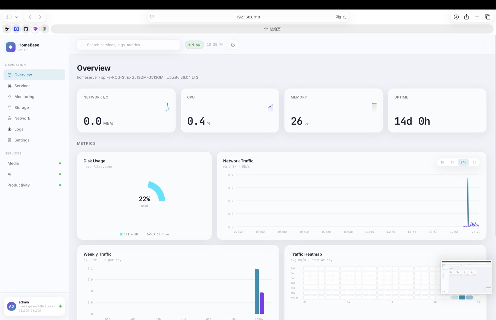
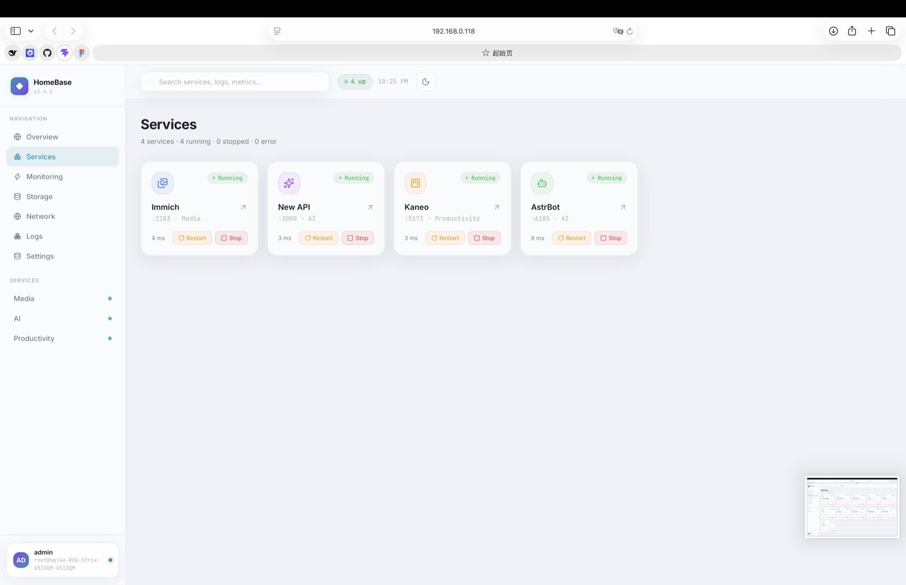
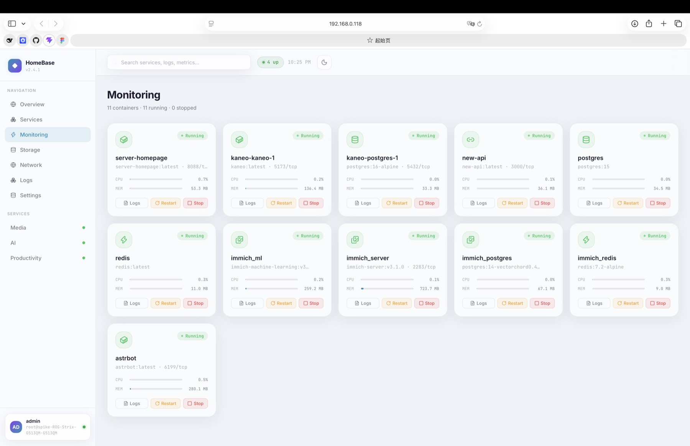

# HomeBase · Server Homepage

自托管服务器仪表盘：单容器（Node/Hono 后端 + React 前端），实时主机指标、服务健康探测、Docker 容器控制与日志、历史图表（自建记录器，无 Prometheus 依赖）。

## 界面

### Overview — 主机总览

KPI 卡（Network I/O / CPU / Memory / Uptime，带 24h 迷你趋势与环比）、磁盘用量、网络流量面积图（1H/6H/24H/7D）、每周流量与 7 天 × 24 小时热力图：



### Services — 服务目录

每服务一张卡：健康探测延迟、容器启停（Start/Stop/Restart）。卡片链接按「打开看板用的地址 + 端口」自动生成，IP/域名/mDNS 访问无需配置：



### Monitoring — 容器监控

全量 Docker 容器卡片：状态徽标、CPU/内存迷你仪表、日志查看（最近 200 行）、启停控制：



## 部署

```bash
git clone git@github.com:UNborracho/Server-HomePage.git
cd Server-HomePage
docker compose up -d --build   # → http://<server-ip>:8088
```

容器挂载 `/proc` `/sys` `/`（只读）读宿主指标，挂载 docker.sock 做容器控制。国内网络默认走镜像加速；海外机器：

```bash
docker build --build-arg NODE_IMAGE=node:22-alpine \
  --build-arg NPM_REGISTRY=https://registry.npmjs.org \
  --build-arg APK_MIRROR=https://dl-cdn.alpinelinux.org .
```

可选环境变量（compose 里改）：`TZ`（默认 `Asia/Shanghai`）、`PORT`（默认 8088）。

## 服务目录（`backend/config/services.json`）

每台服务器一份，**挂载卷，改完即生效**（最迟 ~10s 出现在页面上），部署不会覆盖：

```json
{
  "id": "immich",
  "name": "Immich",
  "category": "Media",
  "iconKey": "images",
  "color": "#3B82F6",
  "port": 2283,
  "scheme": "http",
  "container": "immich_server",
  "url": "http://other-host:8080"
}
```

| 字段 | 必填 | 说明 |
|---|---|---|
| `id` / `name` / `category` / `port` | ✅ | `category` 同时是侧边栏分组 |
| `iconKey` | — | 图标，见下表；未知值回退容器图标 |
| `color` | — | 卡片主题色 `#RRGGBB` |
| `scheme` | — | `http`（默认）/ `https` |
| `container` | — | Docker 容器名；配了才有启停按钮 |
| `url` | — | 显式覆盖链接+探活地址（默认 `scheme://本机:port`，前端按打开看板用的地址自动推导） |

浏览器里的卡片链接按「你打开看板用的地址 + port」自动生成——局域网 IP、域名访问自动适配，无需配置。

**iconKey 可选值**：`images` `image` `film` `video` `music` `camera` `book-open` `gamepad` `file-text` `pen` `notebook` `container` `server` `database` `hard-drive` `cloud` `cpu` `layers` `box` `gauge` `activity` `zap` `globe` `link` `download` `rss` `search` `mail` `message-circle` `bell` `code` `git` `terminal` `shield` `key` `lock` `sparkles` `kanban` `bot` `settings` `users` `calendar` `cart` `wallet`

**容错**：JSON 写坏 / 条目缺 `name`/`port` 时，后端继续用「最后一次正确目录」服务（丢掉的条目记入容器日志），不会 500。

## 开发

```bash
# 前端 :5173（/api 代理到 :8787）
npm run dev
# 后端 :8787（Mac 上无 /proc，指标多为空属正常）
cd backend && PROBE_HOST=127.0.0.1 npm run dev
```

改动 → 服务器部署：`./deploy.sh`（rsync + 重建；自动保护服务器上的 `backend/config/` 与 `data/`）。历史数据在 `./data`（JSONL，15s 采样，30 天保留）。
